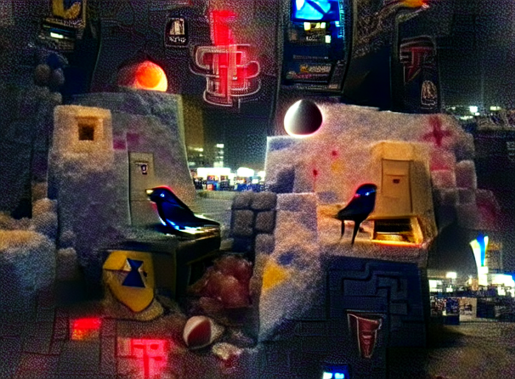

# Modded-Colabs
Some of my modded google colabs

 - Zoetrope 5: 
   - <picture></picture>
     - Images generated using the prompt "A small sapphire bird sits below the massive obsidian arcade machine playing blood tetris under the cold midnight moon."
 - Stable Diffusion: 
   - <picture>SD.webp" alt="ZT->SD.webp"/></picture>
     - The same images shown under Zoetrope 5, inputted to Stable Diffusion with the same prompt.
