# Gallery

## Zoetrope 5

 - Images generated using the prompt `A small sapphire bird sits below the massive obsidian arcade machine playing blood tetris under the cold midnight moon.`
   - <picture>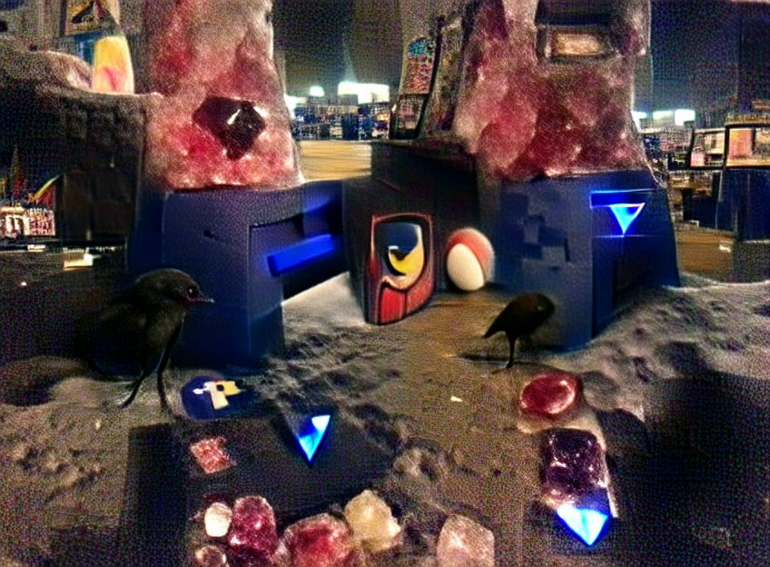</picture>
   - <picture>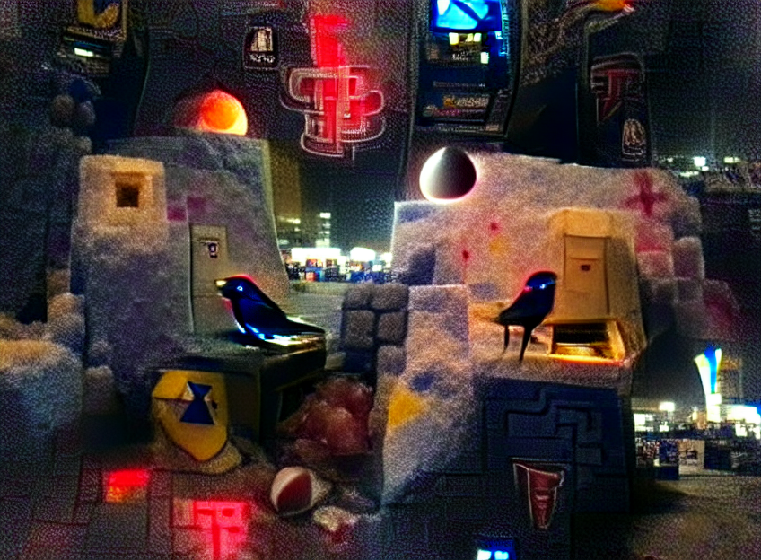</picture>
   - 
 - Generated using the prompt `The ruined grey stone city under the midnight sky has an ominous tower shooting a red beam into the sky.` (the starting image noise was greyscale)
   - <picture></picture>
 - Generated using the prompt `Sketches of an unknown machine` (the starting image noise was greyscale)
   - <picture>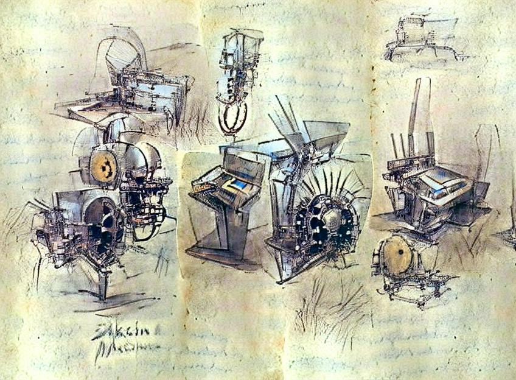</picture>
 - Generated using the prompt `Diagrams and blueprints of the Immortal Cell from Hyper Light Drifter. trending on artstation` (the starting image noise was greyscale)
   - <picture>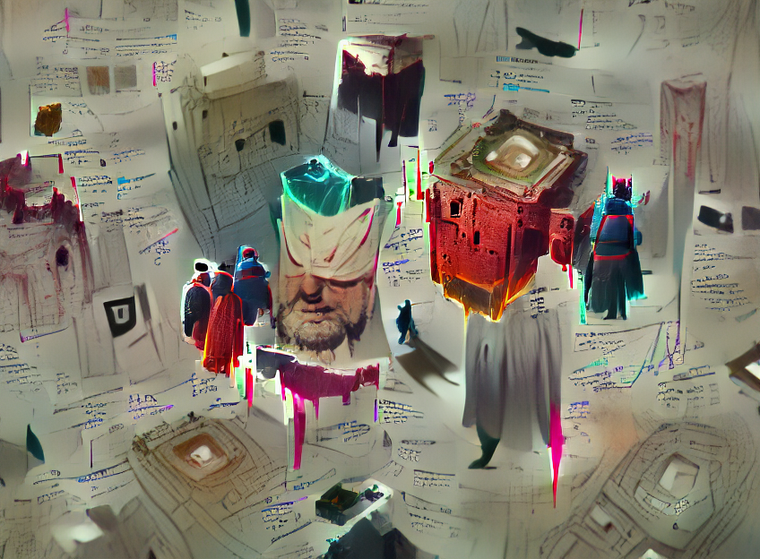</picture>
 - Generated using the prompt `Underwater Ruins. trending on artstation` (the starting image noise was greyscale)
   - <picture>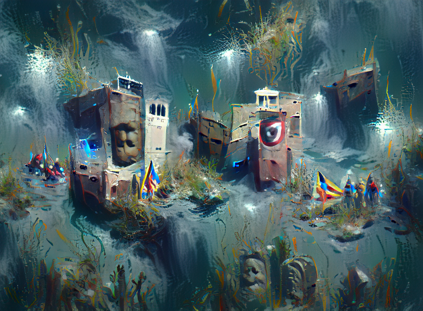</picture>

## Stable diffusion

 - Generated using the prompt `crow wearing a vr headset`
   - <picture>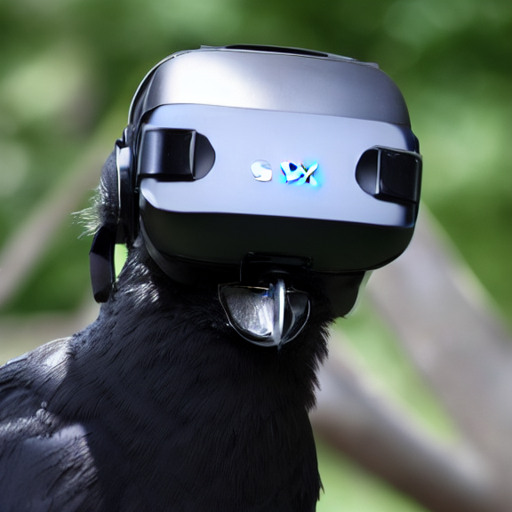</picture>
 - [ZT_2.png](./static/ZT_2.png) inputted to Stable Diffusion with the same prompt.
   - <picture>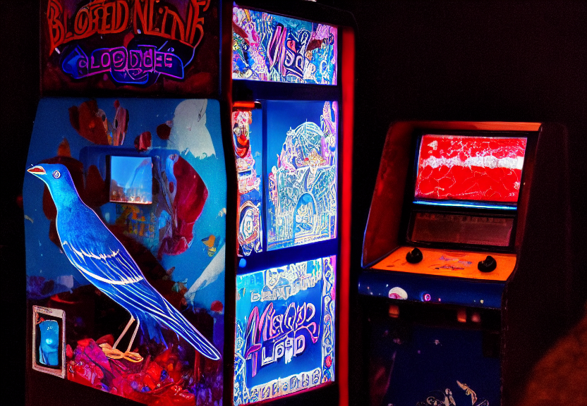</picture>
   - <picture>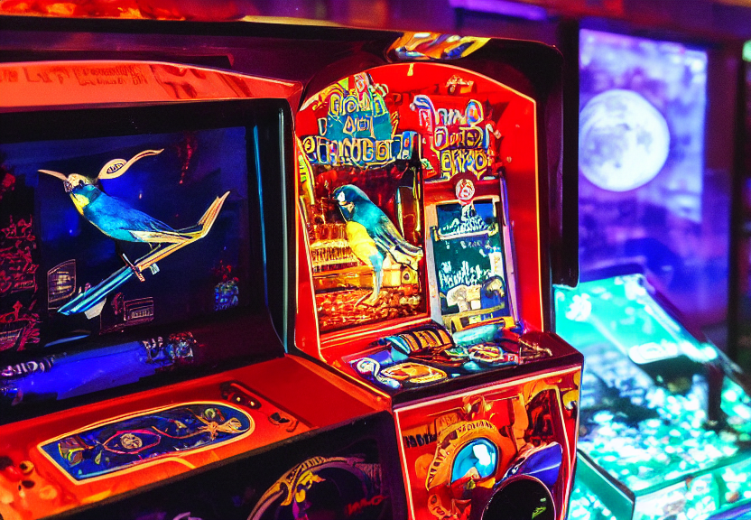</picture>
   - <picture>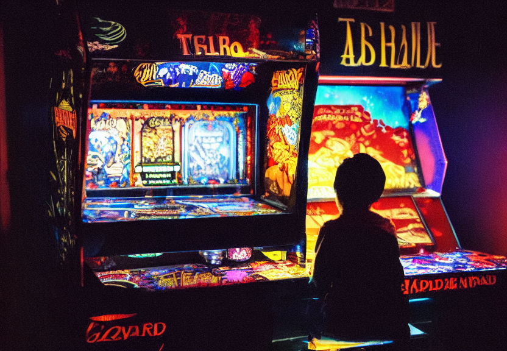</picture>
 - Generated using the prompt `glowing blue white and black crow of frost in a dark neon city. trending on artstation.`
   - <picture>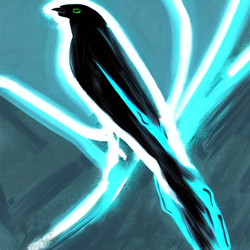</picture>
   - <picture>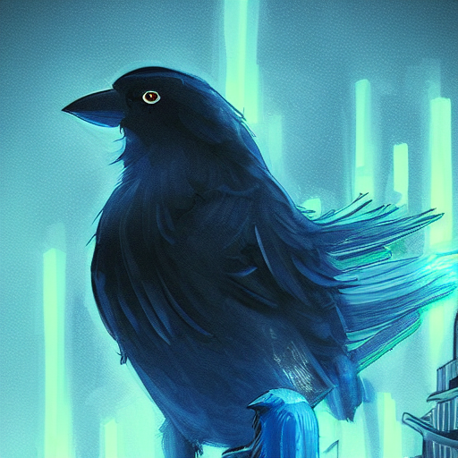</picture>
   - <picture>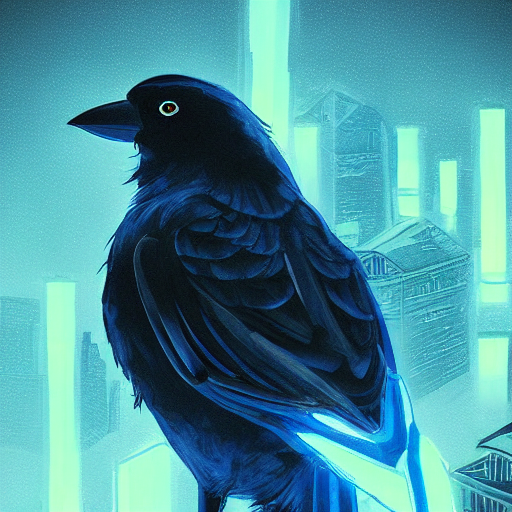</picture>
   - <picture>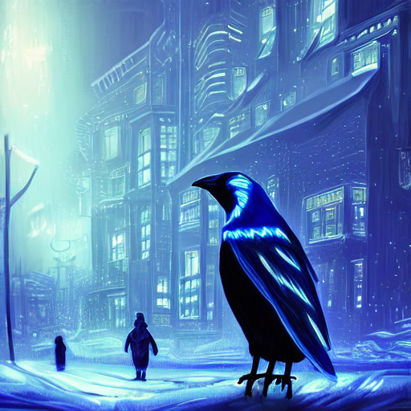</picture>
   - <picture>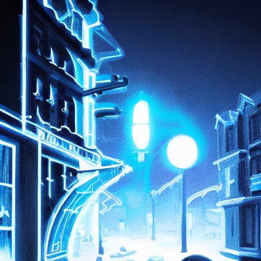</picture>
   - <picture>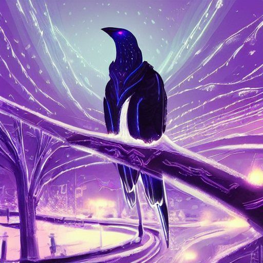</picture>
   - <picture>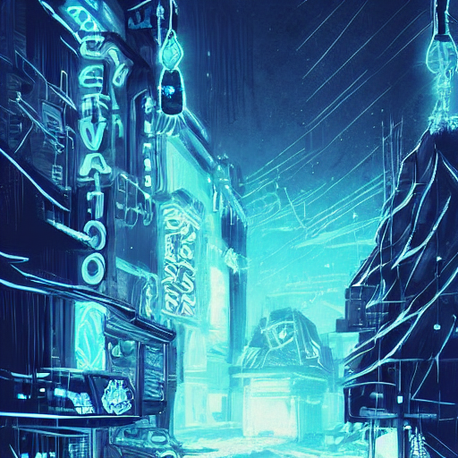</picture>
   - <picture>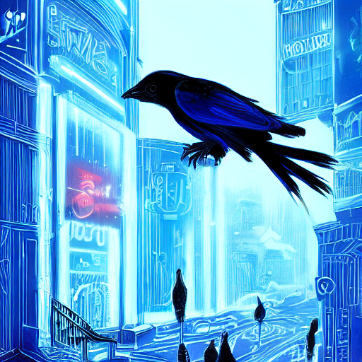</picture>
   - <picture>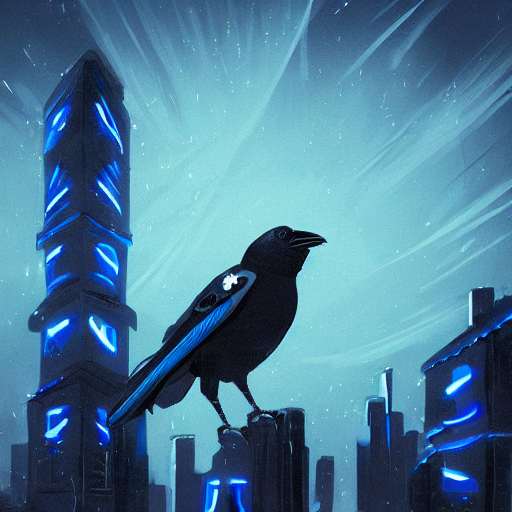</picture>
   - <picture>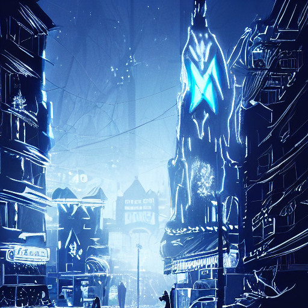</picture>
 - Generated using the prompt `neon blue and white bird in a dark black world of obsidian. trending on artstation. bird`
   - <picture>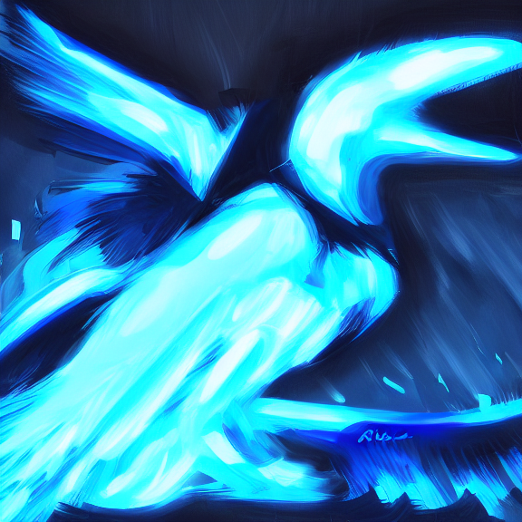</picture>
 - Generated using the prompt `blue dragon in the style of hyper light drifter. abstract digital art trending on artstation.`
   - <picture>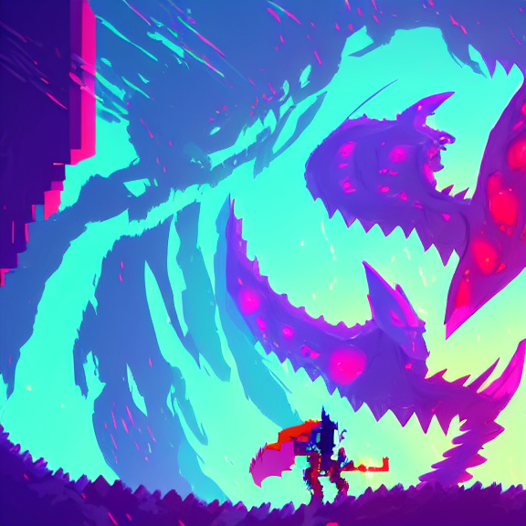</picture>
   - <picture>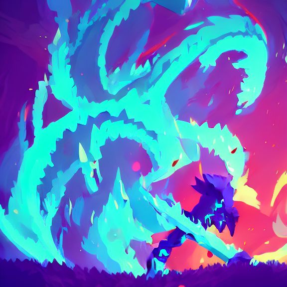</picture>
