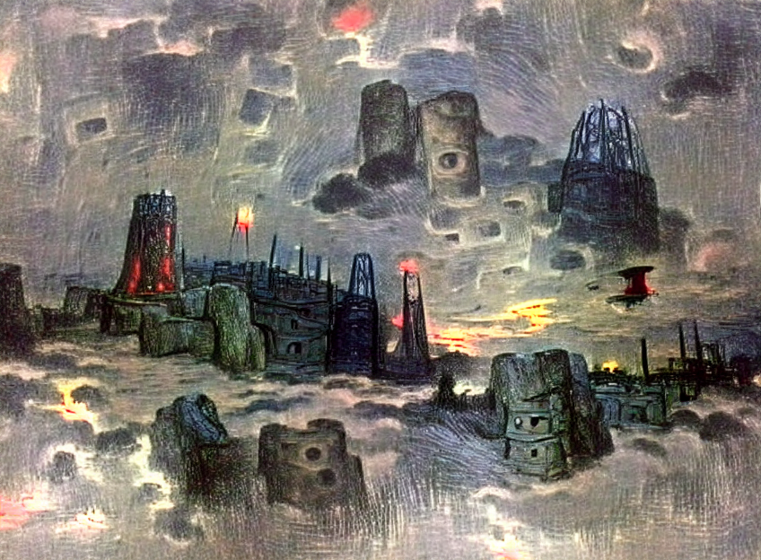

# Gallery

## Zoetrope 5

 - Images generated using the prompt `A small sapphire bird sits below the massive obsidian arcade machine playing blood tetris under the cold midnight moon.`
   - <picture></picture>
   - <picture></picture>
   - 
 - Generated using the prompt `The ruined grey stone city under the midnight sky has an ominous tower shooting a red beam into the sky.` (the starting image noise was greyscale)
   - <picture></picture>
 - Generated using the prompt `Sketches of an unknown machine` (the starting image noise was greyscale)
   - <picture></picture>
   - 
 - Generated using the prompt `Diagrams and blueprints of the Immortal Cell from Hyper Light Drifter. trending on artstation` (the starting image noise was greyscale)
   - <picture></picture>
 - Generated using the prompt `Underwater Ruins. trending on artstation` (the starting image noise was greyscale)
   - <picture></picture>

